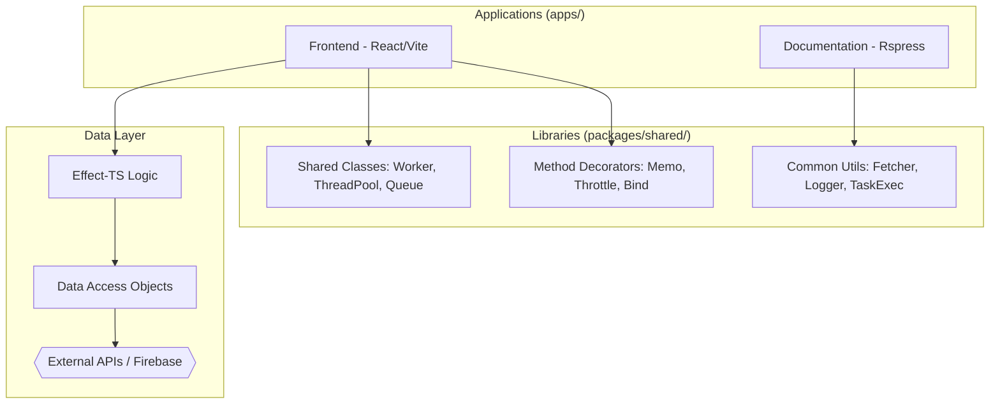
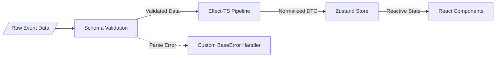

<!--
  Generated by AI-Powered README Generator
  Repository: https://github.com/GDSC-FSC/gdg-fsc-website
  Generated: 2026-01-20T03:21:01.715Z
  Format: md
  Style: comprehensive
-->

# GDG FSC Website

The official high-performance community platform for Google Developer Groups on Campus at Farmingdale State College, built for scalability and developer experience.


---

## 2. Table of Contents
- [Overview](#3-overview)
- [Features](#4-features)
- [Architecture](#5-architecture)
- [Quick Start](#6-quick-start)
- [Usage & Examples](#7-usage--examples)
- [Configuration](#8-configuration)
- [API Reference](#9-api-reference)
- [Development](#10-development)
- [Contributing](#11-contributing)
- [Roadmap & Known Issues](#12-roadmap--known-issues)
- [License & Credits](#13-license--credits)

---

## 3. Overview
The GDG FSC Website serves as the digital hub for students and developers at Farmingdale State College. It provides a centralized platform for discovering upcoming technical events, exploring community-led projects, and meeting the core team members.

The project addresses the need for a high-performance, maintainable community site that can handle complex data flows (like real-time event updates) while remaining accessible. It utilizes a modern **Nx Monorepo** architecture to share logic between the primary frontend and internal documentation tools.

**Who is this for?**
- **Students:** To stay updated on workshops and hackathons.
- **Lead Organizers:** To manage team profiles and event listings.
- **Contributors:** To learn modern full-stack development using Bun, React, and functional programming patterns (Effect-TS).

---

## 4. Features
### 🚀 Core Experience
- ✨ **Ultra-Fast Rendering:** Powered by Vite and Bun for near-instant page loads.
- 📱 **Progressive Web App (PWA):** Fully offline-capable with custom service workers and manifest.
- 🎨 **Unified Design System:** Atomic UI components built with Tailwind CSS and Radix UI.
- 🌓 **Adaptive Theming:** System-aware light/dark mode with smooth transitions.

### 🛠️ Developer-First Tooling
- 📦 **Nx Monorepo:** Shared libraries for decorators, utility classes, and UI components.
- ⚡ **Effect-TS Integration:** Type-safe, functional error handling and dependency injection.
- 🧪 **Multi-Layer Testing:** Unit tests with Vitest and E2E testing with Playwright.
- 🛡️ **Advanced Decorators:** Custom method decorators for `@memoize`, `@rateLimit`, and `@execTime`.

---

## 5. Architecture

### System Overview


### Data Transformation Flow


### Technology Stack
| Layer | Technology | Purpose |
| :--- | :--- | :--- |
| **Runtime** | Bun | JavaScript runtime, package manager, and test runner |
| **Framework** | React 18 | Component-based UI rendering |
| **Logic** | Effect-TS | Type-safe functional programming and error management |
| **Styling** | Tailwind CSS | Utility-first CSS framework |
| **State** | Zustand | Lightweight reactive state management |
| **Infrastructure** | Firebase / Railway | Hosting and CI/CD deployment |

---

## 6. Quick Start

### Prerequisites
- [Bun](https://bun.sh) v1.1.0 or higher
- [Node.js](https://nodejs.org) v20+ (for fallback compatibility)
- Firebase CLI (for deployment)

### Installation
```bash
# Clone the repository
git clone https://github.com/GDSC-FSC/gdg-fsc-website.git
cd gdg-fsc-website

# Install dependencies using Bun
bun install
```

### Running Locally
```bash
# Start the frontend application
bun nx serve frontend

# Start the documentation site
bun nx serve docs
```
The site will be available at `http://localhost:5173`.

---

## 7. Usage & Examples

### Using Method Decorators
The shared library provides high-level decorators to optimize class methods.

```typescript
import { memoize, execTime } from '@gdsc-fsc/shared/decorators';

class EventService {
  @execTime() // Logs execution time to console
  @memoize({ ttl: 60000 }) // Caches results for 1 minute
  async fetchUpcomingEvents() {
    const response = await fetch('/api/events');
    return response.json();
  }
}
```

### Implementing an Effect-TS Flow
Server-side logic uses Effect for robust error handling.

```typescript
import { Effect, pipe } from "effect";
import { getEvents } from "./dal/events-dao";

const program = pipe(
  getEvents(),
  Effect.map((events) => events.filter(e => e.isActive)),
  Effect.catchAll((error) => Effect.logError("Failed to fetch events", error))
);

Effect.runPromise(program);
```

<details>
<summary>Advanced: Thread Pool Usage</summary>

For CPU-intensive tasks, use the built-in Thread Pool:
```typescript
import { ThreadPool } from '@gdsc-fsc/shared/classes';

const pool = new ThreadPool({ size: 4 });
const task = async () => { /* heavy logic */ };
await pool.execute(task);
```
</details>

---

## 8. Configuration

### Environment Variables
Create a `.env` file in `apps/frontend/`.

| Variable | Required | Default | Description |
| :--- | :--- | :--- | :--- |
| `VITE_FIREBASE_API_KEY` | Yes | - | Firebase public API key |
| `VITE_API_BASE_URL` | No | `/api` | Base URL for backend requests |
| `VITE_APP_ENV` | No | `development` | `production`, `staging`, or `development` |

### Firebase Config
The project uses `firebase.json` for hosting configurations, including custom headers for PWA caching and security policies.

---

## 9. API Reference

### Shared Utilities (`@gdsc-fsc/shared/utils`)

#### `fetcher<T>(url: string, options?: FetcherOptions): Promise<T>`
A wrapper around the native Fetch API with built-in error handling and type safety.

| Parameter | Type | Description |
| :--- | :--- | :--- |
| `url` | `string` | The endpoint to hit |
| `options` | `FetcherOptions` | Custom headers, methods, and retry logic |

#### `cn(...inputs: ClassValue[]): string`
Utility for merging Tailwind CSS classes using `clsx` and `tailwind-merge`.

### UI Components (`@gdsc-fsc/interface/ui`)
- **Button:** Polymorphic button component with `ghost`, `outline`, and `primary` variants.
- **Picture:** Optimized image component with lazy loading and WebP support.

---

## 10. Development

### Project Structure
```text
├── apps/
│   ├── frontend/      # Main React application
│   └── docs/          # Rspress-based technical documentation
├── packages/
│   ├── shared/        # Core business logic, classes, and decorators
│   └── interface/     # Design system and UI components (Storybook)
├── tests/
│   ├── vitest/        # Unit and Integration tests
│   └── pw/            # Playwright E2E tests
└── tools/             # Build scripts and Nx generators
```

### Quality Control
- **Linting:** `bun run lint` (via Biome)
- **Testing:** `bun test`
- **E2E:** `bun nx e2e frontend-e2e`

---

## 11. Contributing
We welcome contributions! Please follow these steps:
1. Check the [ISSUE_TEMPLATE.md](.github/ISSUE_TEMPLATE.md) for bug reports or features.
2. Use **Conventional Commits** (e.g., `feat: add community section`).
3. Ensure all tests pass: `bun run test`.

Refer to [CONTRIBUTING.md](.github/CONTRIBUTING.md) for full details on our PR process.

---

## 12. Roadmap & Known Issues
- [ ] Integration with Google Calendar API for automated event syncing.
- [ ] Member dashboard for workshop check-ins.
- [ ] Interactive project roadmap visualization.

⚠️ **Known Issue:** View Transitions API is currently experimental; some layout shifts may occur in non-Chromium browsers. Workaround: Handled via `view-transition-handler.tsx`.

---

## 13. License & Credits
### License
This project is licensed under the **MIT License**. See the `LICENSE` file for details.

### Acknowledgments
- **Google Developer Groups:** For providing the framework for student communities.
- **Mike Odnis:** Lead Engineer and Architect.
- **Shadcn UI:** For the foundational UI component patterns.

---
**Maintainer:** [GDG on Campus Farmingdale State College](https://github.com/GDSC-FSC)