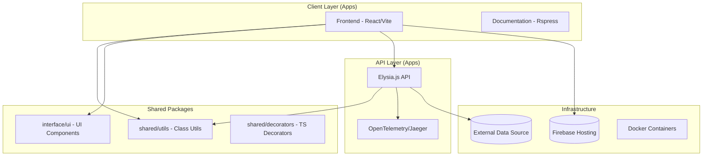
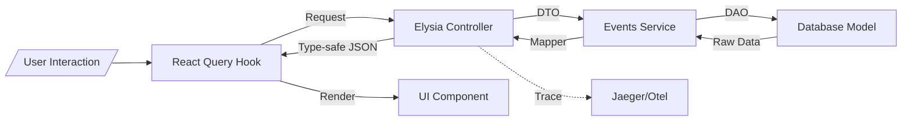

<!--
  Generated by AI-Powered README Generator
  Repository: https://github.com/GDSC-FSC/gdg-fsc-website
  Generated: 2026-01-07T07:34:01.850Z
  Format: md
  Style: comprehensive
-->

# GDG on Campus Farmingdale State College Website

A high-performance, student-centric community platform for the Google Developer Group at Farmingdale State College. Built with a focus on speed, type safety, and modern developer experience.


## Table of Contents

- [Overview](#overview)
- [Features](#features)
- [Architecture](#architecture)
- [Quick Start](#quick-start)
- [Usage & Examples](#usage--examples)
- [Configuration](#configuration)
- [API Reference](#api-reference)
- [Development](#development)
- [Contributing](#contributing)
- [Roadmap & Known Issues](#roadmap--known-issues)
- [License & Credits](#license--credits)

## Overview

The **GDG on Campus Farmingdale State College Website** serves as the digital headquarters for our student developer community. The project is designed to bridge the gap between academic learning and professional software engineering by providing a real-world platform where students can track events, collaborate on projects, and manage community leadership.

The solution addresses the need for a central hub that is both a high-performance consumer-facing application and a robust playground for testing advanced architectural patterns like Monorepos, PWA capabilities, and distributed tracing.

**Who is this for?**
- **Student Members:** To discover upcoming workshops, hackathons, and community projects.
- **Chapter Leads:** To manage event listings and showcase the leadership team.
- **Contributors:** For students looking to gain experience with modern tech stacks (React, Bun, Elysia, Nx).

## Features

### 🎨 Frontend Experience
- ✨ **Dynamic & Responsive UI**: Built with React and optimized with Vite for near-instant load times.
- ⚡ **PWA Support**: Full offline capabilities and installability via `vite-pwa-plugin`.
- 🪄 **Fluid Transitions**: Utilizes the experimental View Transitions API for app-like navigation.
- 🧩 **Shadcn UI & Tailwind**: Beautiful, accessible components with utility-first styling.
- 📈 **Server State**: Robust data fetching and caching using `@tanstack/react-query`.

### ⚙️ Backend & Infrastructure
- 🚀 **Bun-powered Elysia**: High-performance REST API with end-to-end type safety.
- 🛡️ **Security First**: Integrated JWT Bearer auth, CSP headers via Helmet, and rate limiting.
- 🕵️ **Observability**: Distributed tracing with OpenTelemetry and Jaeger integration.
- 📦 **Monorepo Architecture**: Managed with Nx for efficient builds and shared logic.

### 🛠️ Shared Utilities (Packages)
- 🧪 **Advanced Decorators**: Method-level logic for memoization, debouncing, and execution timing.
- 🧵 **Multi-threading**: Custom `ThreadPool` and `WorkerThread` implementations for heavy tasks.
- 🔒 **Data Protection**: `Redacted` class for handling sensitive information.

## Architecture

The project follows a Monorepo structure, separating concerns into applications and reusable packages.

### System Architecture


### Data Flow Diagram


### Tech Stack Table
| Layer | Technology | Purpose |
| :--- | :--- | :--- |
| **Runtime** | Bun | JavaScript runtime, package manager, and test runner |
| **Frontend** | React 18+ | UI Framework |
| **Backend** | Elysia.js | High-performance Web Framework |
| **Styling** | Tailwind CSS | Utility-first CSS |
| **State** | Zustand / React Query | Global and Server-side state management |
| **Observability** | Jaeger / OpenTelemetry | Distributed tracing and monitoring |
| **Testing** | Playwright / Vitest / Cypress | Multi-layer testing strategy |

## Quick Start

### Prerequisites
- **Bun**: >= 1.1.0 (Required)
- **Node.js**: >= 20.x (For specific tool compatibility)
- **Docker**: For running observability stack (Optional)

### Installation
```bash
# Clone the repository
git clone https://github.com/GDSC-FSC/gdg-fsc-website.git
cd gdg-fsc-website

# Install dependencies using Bun
bun install
```

### Running Locally
```bash
# Start frontend and backend in development mode
bun run dev

# Start only the frontend
bun run dev:frontend

# Start the observability stack (Jaeger)
docker-compose -f docker/docker-compose.yml up -d
```
The frontend will be available at `http://localhost:5173`.

## Usage & Examples

### Using Shared Decorators
The repository provides advanced TypeScript decorators in `@packages/shared`.

```typescript
import { Memoize, ExecTime, Debounce } from '@packages/shared/decorators';

class DataService {
  // Caches result based on arguments
  @Memoize()
  async fetchHeavyData(id: string) {
    // ... logic
  }

  // Logs execution time to console/telemetry
  @ExecTime()
  processAnalytics() {
    // ... logic
  }

  // Limits execution to once every 300ms
  @Debounce(300)
  handleSearch(query: string) {
    // ... logic
  }
}
```

### Data Fetching Example
Standardized data fetching pattern using React Query and the internal API client.

```tsx
import { useQuery } from '@tanstack/react-query';
import { eventsService } from '@/server/service';

export const EventsList = () => {
  const { data, isLoading } = useQuery({
    queryKey: ['events'],
    queryFn: () => eventsService.getAllEvents()
  });

  if (isLoading) return <LoadingSpinner />;
  
  return (
    <div>
      {data.map(event => <EventCard key={event.id} {...event} />)}
    </div>
  );
};
```

## Configuration

### Environment Variables
Create a `.env` file in `apps/frontend` and `apps/api`.

| Variable | Required | Default | Description |
| :--- | :--- | :--- | :--- |
| `VITE_API_URL` | Yes | `http://localhost:3000` | Backend API URL |
| `JWT_SECRET` | Yes | - | Secret for token signing |
| `OTEL_EXPORTER_OTLP_ENDPOINT` | No | `http://localhost:4317` | OpenTelemetry collector endpoint |
| `NODE_ENV` | No | `development` | Environment mode |

## API Reference

### Backend Endpoints (Elysia)

#### `GET /api/v1/events`
Returns a list of all community events.
- **Returns**: `EventResponseDTO[]`
- **Auth**: Not Required

#### `POST /api/v1/auth/login`
Authenticates a user and returns a JWT.
- **Body**: `{ email, password }`
- **Returns**: `{ token, user }`

### Shared Class Utilities

| Class | Method | Description |
| :--- | :--- | :--- |
| `ThreadPool` | `execute(task)` | Offloads a task to a background worker thread. |
| `TimeManager` | `startTimer(id)` | Precision timing for performance profiling. |
| `Redacted` | `wrap(value)` | Wraps sensitive strings to prevent accidental logging. |

<details>
<summary>View Detailed Worker Example</summary>

```typescript
import { ThreadPool } from '@packages/shared/classes';

const pool = new ThreadPool(4); // 4 workers
const result = await pool.execute(async () => {
  // This runs in a separate thread
  return complexCalculation();
});
```
</details>

## Development

### Project Structure
- `apps/frontend`: React client application.
- `apps/api`: Elysia.js backend.
- `apps/docs`: Documentation site (Rspress).
- `packages/shared`: Core utilities and decorators.
- `packages/interface`: Shared UI components and Storybook.

### Quality Control
```bash
# Lint code
bun run lint

# Format code
bun run format

# Run unit tests
bun run test:unit

# Run E2E tests (Playwright)
bun run test:e2e
```

## Contributing

We welcome contributions from Farmingdale State College students and the wider GDG community.

1. **Check Issues**: Look for "good first issue" labels.
2. **Branching**: Use `feat/`, `fix/`, or `docs/` prefixes.
3. **Commit Messages**: Follow [Conventional Commits](https://www.conventionalcommits.org/).
4. **Pull Requests**: Ensure all tests pass and a description is provided.

Refer to [CONTRIBUTING.md](./.github/CONTRIBUTING.md) for full details.

## Roadmap & Known Issues

- [ ] **Internationalization (i18n)**: Multi-language support for the main site.
- [ ] **Admin Dashboard**: Integrated UI for managing events and members.
- [ ] **Dark Mode Sync**: System-level theme detection and persistence.
- [x] **PWA Implementation**: Basic service worker and manifest.
- [ ] **WebSockets**: Real-time event updates.

⚠️ **Known Issue**: The View Transitions API is currently only supported in Chromium-based browsers. Safari and Firefox will fall back to standard navigation.

## License & Credits

This project is licensed under the **MIT License**.

- **Maintainer**: GDG on Campus Farmingdale State College.
- **Inspiration**: Built with the spirit of "Google Developers" and student innovation.
- **Key Dependencies**: React, Bun, Elysia, Nx, TailwindCSS, Shadcn UI.