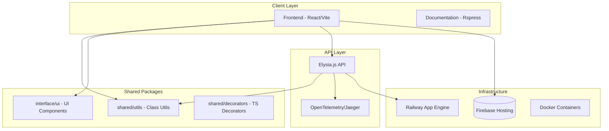
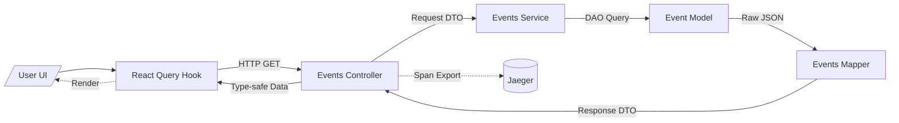

<!--
  Generated by AI-Powered README Generator
  Repository: https://github.com/GDSC-FSC/gdg-fsc-website
  Generated: 2026-01-20T03:18:08.534Z
  Format: md
  Style: comprehensive
-->

# GDG on Campus Farmingdale State College Website

A high-performance community platform for the Google Developer Group at Farmingdale State College, built with a focus on type safety, observability, and modern developer experience.


## Table of Contents

- [Overview](#overview)
- [Features](#features)
- [Architecture](#architecture)
- [Quick Start](#quick-start)
- [Usage & Examples](#usage--examples)
- [Configuration](#configuration)
- [API Reference](#api-reference)
- [Development](#development)
- [Contributing](#contributing)
- [Roadmap & Known Issues](#roadmap--known-issues)
- [License & Credits](#license--credits)

## Overview

The **GDG on Campus Farmingdale State College Website** is a centralized hub designed to foster
collaboration and engagement within the student developer community. The platform addresses the
challenge of fragmented communication by providing a single point of truth for event tracking,
leadership management, and project showcasing.

Beyond its utility as a community site, the project serves as a production-grade demonstration of
modern web engineering. It implements a sophisticated Monorepo architecture using Nx, high-performance
runtime via Bun, and advanced TypeScript patterns like method decorators and custom thread pooling.

**Who is this for?**
- **Student Developers:** Seeking workshops, hackathons, and local networking.
- **Chapter Leads:** Managing community content and tracking engagement metrics.
- **Open Source Contributors:** Looking to work with a cutting-edge stack (React, Elysia.js, Bun).

## Features

### 🎨 Frontend Experience
- ✨ **Bionic Performance**: Instant page loads via Vite and React 18+ concurrency.
- 📱 **Progressive Web App**: Full offline support and mobile installability via `vite-plugin-pwa`.
- 🪄 **View Transitions**: Seamless navigation animations using the experimental View Transitions API.
- 🧩 **Component System**: Modular UI library built with Shadcn/UI and Tailwind CSS.

### ⚙️ Backend & Logic
- 🚀 **Elysia.js Integration**: Type-safe REST API endpoints with end-to-end inference.
- 🛡️ **Advanced Decorators**: Logic for `@Memoize`, `@Throttle`, and `@ExecTime` at the method level.
- 🧵 **Parallel Processing**: Custom `ThreadPool` implementation for CPU-intensive tasks.
- 🕵️ **Distributed Tracing**: Full observability using OpenTelemetry and Jaeger.

### 🛠️ Developer Tooling
- 📦 **Monorepo Structure**: Logic sharing between `frontend`, `docs`, and `shared` libraries.
- 🧪 **Multi-tier Testing**: Unit tests (Vitest), E2E (Playwright), and UI (Storybook).
- 🧹 **Automated Quality**: Biome for linting/formatting and audit-ci for vulnerability scanning.

## Architecture

The project is structured as an Nx Monorepo, separating core application logic from reusable utilities.

### Component Relationship


### Data Flow (Event Fetching)


### Tech Stack
| Layer | Technology | Purpose |
| :--- | :--- | :--- |
| **Runtime** | Bun | JavaScript runtime, package manager, and test runner |
| **Monorepo** | Nx | Workspace management and build orchestration |
| **Frontend** | React 18 | UI logic and rendering |
| **Backend** | Elysia.js | High-performance Web Framework |
| **Observability** | OpenTelemetry | Distributed tracing and performance monitoring |
| **Styles** | Tailwind CSS | Utility-first CSS framework |

## Quick Start

### Prerequisites
- **Bun**: `^1.1.0` (Recommended)
- **Node.js**: `^20.0.0` (Fallback)
- **Docker**: For running local tracing services

### Installation
```bash
# Install dependencies
bun install

# Generate internal build artifacts
bun run nx run-many -t build
```

### Running Locally
```bash
# Start the full stack (Frontend + API)
bun run dev

# Start local infrastructure (Jaeger)
docker-compose -f docker/docker-compose.yml up -d
```
Access the application at `http://localhost:5173`.

## Usage & Examples

### Utilizing Method Decorators
The `@packages/shared` library includes decorators to handle cross-cutting concerns without bloating
business logic.

```typescript
import { Memoize, ExecTime, RateLimit } from '@packages/shared/decorators';

class CommunityService {
  // Caches result for 5 minutes
  @Memoize({ ttl: 300000 })
  async getLeaderboard() {
    return await db.users.findMany();
  }

  // Logs execution duration to telemetry
  @ExecTime()
  async processLargeDataset(data: any[]) {
    // ... logic
  }

  // Limits calls to 10 per minute
  @RateLimit({ windowMs: 60000, max: 10 })
  async submitFeedback(data: string) {
    // ... logic
  }
}
```

### Thread Pool for Heavy Tasks
For CPU-intensive operations like image processing or complex data mapping, use the internal
`ThreadPool`.

```typescript
import { ThreadPool } from '@packages/shared/classes';

const pool = new ThreadPool({ minThreads: 2, maxThreads: 4 });

async function handleHeavyTask() {
  const result = await pool.execute(async () => {
    // This runs in a background Worker thread
    return performExpensiveCalculation();
  });
  console.log(result);
}
```

## Configuration

### Environment Variables
| Variable | Required | Default | Description |
| :--- | :--- | :--- | :--- |
| `VITE_API_URL` | Yes | `http://localhost:3000` | Backend API base URL |
| `OTEL_EXPORTER_OTLP_ENDPOINT` | No | `http://localhost:4317` | OpenTelemetry collector endpoint |
| `FIREBASE_API_KEY` | Yes | - | Firebase configuration for hosting/auth |
| `NODE_ENV` | No | `development` | Runtime environment (dev/prod) |

### File Locations
- **Nx Config**: `nx.json`
- **Bun Config**: `bunfig.toml`
- **Styles**: `apps/frontend/src/tailwind.css`
- **Linting**: `biome.json`

## API Reference

### Shared Utilities (`@packages/shared`)

#### `Fetcher` Class
A wrapper around `fetch` with built-in retry logic and type-safe response handling.

| Method | Parameters | Return |
| :--- | :--- | :--- |
| `get<T>(url, options)` | `string, RequestInit` | `Promise<T>` |
| `post<T>(url, body, options)` | `string, any, RequestInit` | `Promise<T>` |

#### `Logger` Class
Standardized logging interface with support for multiple levels and telemetry integration.

| Level | Description | Output Target |
| :--- | :--- | :--- |
| `info` | General operational info | Stdout / Jaeger |
| `warn` | Non-critical issues | Stdout / Jaeger |
| `error` | Critical failures | Stderr / Sentry (if enabled) |

## Development

### Project Structure
```text
├── apps/
│   ├── frontend/      # React SPA application
│   ├── docs/          # Rspress documentation site
├── packages/
│   ├── interface/     # UI Component library (Storybook)
│   ├── shared/        # Core utilities, classes, and decorators
├── tests/
│   ├── pw/            # Playwright E2E tests
│   ├── vitest/        # Unit and Integration test config
└── docker/            # Deployment and Infra orchestration
```

### Quality Control Commands
```bash
# Run all unit tests
bun run test

# Format and lint code
bun run lint:fix

# Run E2E tests
bun run test:e2e
```

## Contributing

We welcome student contributors! Please follow these guidelines:

1.  **Branching**: Use `feature/` or `fix/` prefixes (e.g., `feature/add-event-filters`).
2.  **Commits**: Follow [Conventional Commits](https://www.conventionalcommits.org/).
3.  **PRs**: Ensure all tests pass and a screenshot is provided for UI changes.

See [CONTRIBUTING.md](./.github/CONTRIBUTING.md) for full details.

## Roadmap & Known Issues

- [x] Migrate to Bun runtime
- [x] Implement OpenTelemetry tracing
- [ ] Add real-time chat via WebSockets
- [ ] Integrate Google Calendar API for automatic event sync
- [ ] Mobile App (Capacitor) wrapper

**Known Issues:**
- ⚠️ **View Transitions**: Navigation may feel jittery on Safari as it lacks native support (experimental).
- ⚠️ **Monorepo Caching**: Occasionally `nx reset` is required if build artifacts desync.

## License & Credits

**License**: MIT License. See [LICENSE](LICENSE) for details.

**Maintained by**:
- GDG on Campus Farmingdale State College
- Lead Developer: [Mike] (See AUTHORS.md for full list)

**Special Thanks**:
- Google Developer Groups for community support.
- The Nx and Bun teams for the incredible tooling.